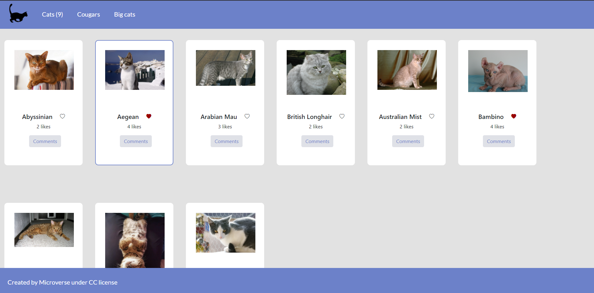

# Js Capstone Project

> Started working with Apis. Get data and send it to different Apis.

## Built With

- Html, Javascript, SCSS
- Webpack
- Developed in VSCode

To get a local copy up and running follow these simple example steps.
Run:
- `git clone https://github.com/hunter4466/js-capstone-proj-kanban-board.git`
- `cd js-capstone-proj-kanban-board`
-`Install node_modules, run npm install and install the latest node version`
- Open ./dist/index.html in browser or run 'npm run start' from the command line.

## Link

Get a live preview of the project on this link

- Link: [Live-Preview](https://hunter4466.github.io/js-capstone-proj-kanban-board/dist/index.html)

## Authors

👤 **Mario Chois**

- Github: [Hunter4466](https://github.com/hunter4466)

👤  **Carlos Ospina**

- GitHub: [Carloso0114](https://github.com/carloso0114)
- LinkedIn: [Carlos Ospina](https://www.linkedin.com/in/carlosospina/)

## 🤝 Contributing

Contributions, issues, and feature requests are welcome!

Feel free to check the [issues page](https://github.com/hunter4466/js-capstone-proj-kanban-board/issues).

## Show your support

Give a ⭐️ if you like this project!

## 📝 License

This project is [MIT](./MIT.md) licensed.